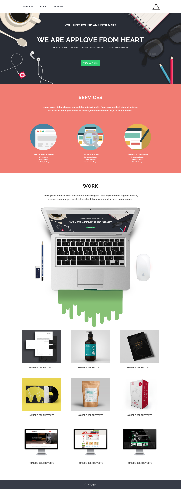

# AppLove

### En este repositorio presento el desarrollo de la actividad propuesta por mis instructores en Laboratoria.

### Para el desarrollo del ejercicio se nos autorizó _forkear_ y _clonar_ el repositorio original de nuestra junior teacher. Este contenía las instrucciones y guías para poder desarrollar la actividad con éxito.

### A continuación, el resultado que se espera:

 

### Consideraciones generales:

- Pixel perfect (replicar el diseño con exactitud)
- Nombramiento de clases, id, etc
- Indentación
- Estructura de tus archivos
- Archivo `README.md` actualizado y correctamente redactado
- Uso de comentarios para hacer tu código más legible
